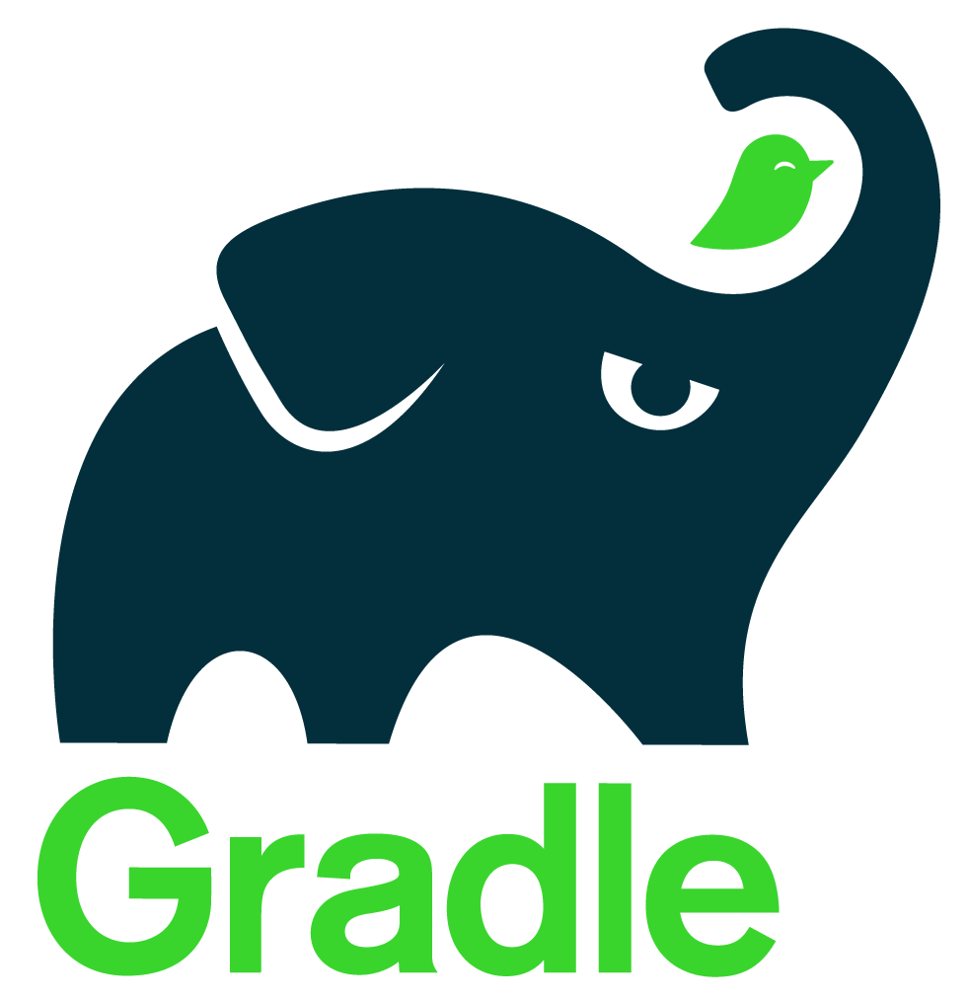
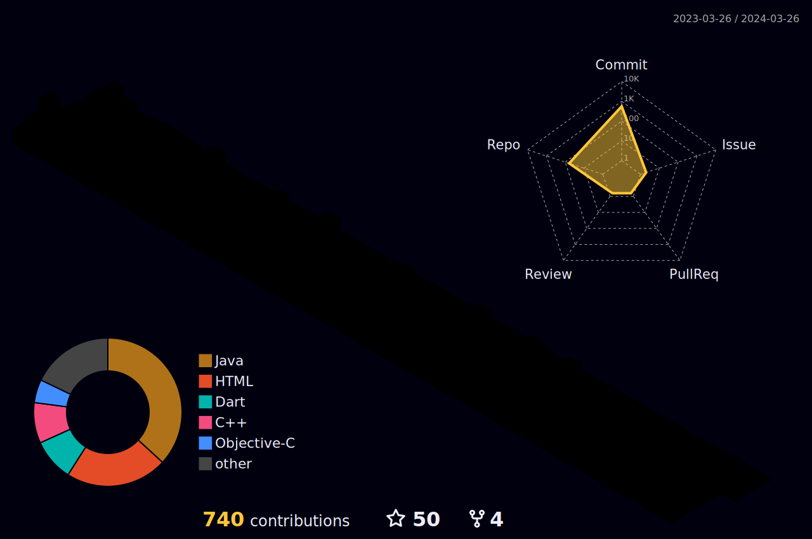

  

<!--    -->

  

  
  

<!--Header Name-->
#  Hi there ! Get to Know Me ...
*Digital Craftsman (Developer / Programmer / Software Development Engineer)*
  

- 💳 My name is **Khirasagar** . 
- 🎯 I am a multifaceted **software developer** and **artist**, fueled by **creativity** and **enthusiastiasm**.
- 🖋️ I'm a Bachelor of Technology Undergrad.
- 📚 My major is **Computer Science and Engineering**.
<!--  - 🌍 I'm currently based in **Bengaluru, India**. -->
-  ❤ Contributing to **Open Source**.
- 🤝 I’m looking to collaborate on: **Fullstack projects**
- 📚 I’m currently focused on : **Spring Security, JWT Token Authorization and Authentication, ER Diagrams, RESTful APIs Springboot, Hibernate and MySQL**.

 

<h4 align="center" border="0" dir="auto">📫 How can you reach me?</h4>

## 🚀 In-Use Tech Stacks: JAVA FULLSTACK and J2EE

<table align="center">

<tr>
     <td align="center">
    
  </td>
    <td align="center">
      
    </td>
    <td align="center">
      
    </td>    
    <td align="center">
       
    </td>
</tr>

  <tr>
     <td align="center">
    
  </td>
    <td align="center">
      
    </td>
    <td align="center">
      
    </td>    
    <td align="center">
       
    </td>
</tr>

<tr>
<td align="center">

    
</td>
<td align="center">
    
</td>
<td align="center">
      
    
</td>
<td align="center">
  

</td>
  
</tr>

  <tr>
  <td align="center">
    
  </td>
   <td align="center">
    
  </td>

 <td align="center">
      
    </td>
  <td align="center">
    
  </td>
</tr>

  
  <tr>
    <td align="center">
      
    </td>
    <td align="center">
      
    </td>
    <td align="center">
      
    </td>
    <td align="center">
      
    </td>
  </tr>
  
  <tr>
    <td align="center">
      
    </td>
    <td align="center">
      
    </td>
    <td align="center">
      
    </td>
    <td align="center">
      
    </td>
  </tr>
</table>

## 🚀Most recent Tech Stacks: MERN-Stack

<table align="center">
  <tr>
    <td align="center">
      
    </td>
    <td align="center">
      
    </td>
    <td align="center">
      
    </td>
    <td align="center">
      
    </td>
  </tr>
  <tr>
    <td align="center">
      
    </td>
    <td align="center">
      
    </td>
    <td align="center">
      
    </td>
    <td align="center">
      
    </td>
  </tr>
  <tr>
    <td align="center">
      
    </td>
    <td align="center">
      
    </td>
    <td align="center">
      
    </td>
     <td align="center">
      
    </td>

    
  </tr>
</table>

 

## Development Stack
### Programming Languages

### Databases

### Web Development

### Java Backend Development

### Frontend Frameworks and Libraries

### APIs

### AI / ML

### Design

### IDEs

### Version controls

### Deployment

### Operating System Compatibility

 

  <picture>
    <source media="(prefers-color-scheme: dark)" srcset="https://raw.githubusercontent.com/devrohit06/devrohit06/output/github-snake-dark.svg" />
    <source media="(prefers-color-scheme: light)" srcset="https://raw.githubusercontent.com/devrohit06/devrohit06/output/github-snake.svg" />
    
  </picture>

## 📈 My GitHub Stats

<!-- 
  

 -->

  
|  |  |
| -- | -- |

   
    
  

   
  <b>Note:</b> Top languages is only a metric of the languages my public code consists of and doesn't reflect experience or skill level.

 
 
<table>
  <tr>
    <td>
<!--       

        
      
 -->
<!-- // ////////////////////////////////////////////////////////////.....//// -->
       

        

    </td>
    <td>
      

        
      

    </td>
    <td>
      

        

    </td>
  </tr>
</table>

 
<table align="center">
  <tr>
    <td></td>
    <td></td>
  </tr>
</table>

<!-- Light Mode -->

 

<!-- Dark Mode -->

 

   

  

<h2 align="center">🏆 Gɪᴛʜᴜʙ Tʀᴏᴘʜɪᴇs 🏆</h2>

  

 

  
  <h2 align="center">📈 My Contribution graph 📈</h2>

    

  
## 😂 Here is a random joke that'll make you laugh!

 

 

## 🙋‍♂️ Socials

  

  :heart_eyes: Thanks for visiting my profile! Have a nice day! :wink:  
  &copy; 2023 Khirasagar Maharana

---

Credits: [Khirasagar Maharana](https://github.com/Khirasagar)

