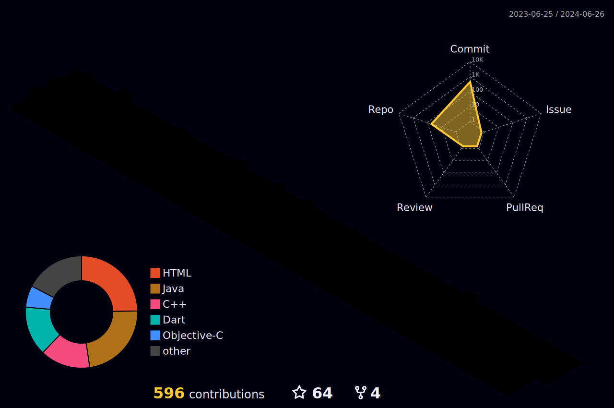

  

<!--    -->
    
  

## 👋 Get to Know Me!  😀

- 💳 My full name is **Khirasagar Maharana** . 
- 🎯 I'm a versatile **Fullstack Developer** adept at both **frontend** and **backend** work, ensuring seamless and feature-rich web application development.
- 🏫 I'm currently a professional career aspirant.
- 🖋️ I'm a Bachelor of Technology Undergrad from **GIET University**.
- 📚 My major is **Computer Science and Engineering**.
- 🌍 I'm currently based in **Odisha, India**.
- 🧐 I'm fascinated by coding 💻, memes😆, webseries 🎥.

 

<h2 align="center" border="0" dir="auto"><a id="user-content-my-tech-stack" class="anchor" aria-hidden="true" href="#my-tech-stack"><svg class="octicon octicon-link" viewBox="0 0 16 16" version="1.1" width="16" height="16" aria-hidden="true"><path fill-rule="evenodd" d="M7.775 3.275a.75.75 0 001.06 1.06l1.25-1.25a2 2 0 112.83 2.83l-2.5 2.5a2 2 0 01-2.83 0 .75.75 0 00-1.06 1.06 3.5 3.5 0 004.95 0l2.5-2.5a3.5 3.5 0 00-4.95-4.95l-1.25 1.25zm-4.69 9.64a2 2 0 010-2.83l2.5-2.5a2 2 0 012.83 0 .75.75 0 001.06-1.06 3.5 3.5 0 00-4.95 0l-2.5 2.5a3.5 3.5 0 004.95 4.95l1.25-1.25a.75.75 0 00-1.06-1.06l-1.25 1.25a2 2 0 01-2.83 0z"></path></svg></a>📫 How can you reach me?</h2>

## 🚀 In-Use Tech Stacks:

 
    
    
     
     
     
    
    
   
    
    

 

## Development Stack
### Programming Languages

### Databases

### Web Development

#### Frameworks and Libraries

### API

### AI / ML

### Design

### IDEs

### Version controls

### Deployment

 

## 📈 My GitHub Stats

<!-- 
  

 -->

   
    
  

   
  <b>Note:</b> Top languages is only a metric of the languages my public code consists of and doesn't reflect experience or skill level.

 
 
<table>
  <tr>
    <td>
      

        
      

    </td>
    <td>
      

        
      

    </td>
  </tr>
</table>

 
<table>
  <tr>
    <td></td>
    <td></td>
  </tr>
</table>
   
  
## 😂 Here is a random joke that'll make you laugh!

 

   &nbsp;&nbsp;

   &nbsp;&nbsp;

## 🙋‍♂️ Connect with Me

  :heart_eyes: Thanks for visiting my profile! Have a nice day! :wink:  
  &copy; 2023 Khirasagar Maharana

---

Credits: [Khirasagar Maharana](https://github.com/Khirasagar)

Last Edited on: 17/09/2023

